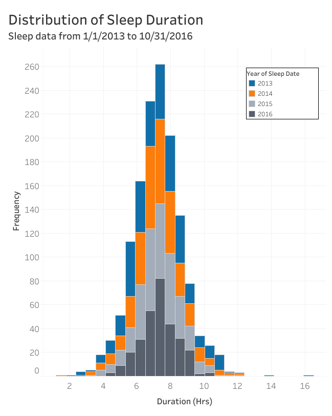
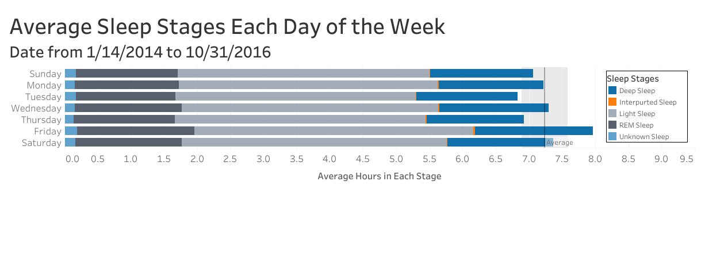

# A Case Study of Sleep Quality from 2013 - 2016
This is a Case Study of sleep data from a friend. The goal is to anwer their specific questions about their sleep quality in the form of slides and supported with visualizations.

## Supporting Files Description
All of the SQL, R, and Python codes and files that were used in this analysis can be found in their respective project directories. 

## Tools Used
**Data Warehouse:** BigQuery  
**Query Language:** SQL  
**Coding Language:** R  
**Data Visualizations:** R and Tableau  
**Reporting:** R Markdown and Google Sheets

## Skills Demonstrated
- Data cleaning using R and SQL
- Data manipulation using R
- Data visualization using R and Tableau
- Analysis reporting and recommendations documented in a Google Sheets

## Data 
The data was collected from a Basis B1 fitness tracker from 1/1/2013 to 10/31/2016.

### Data Limitations
The data was limited to the nights that the user wore the tracker. 
The sleep stage data feature was not available until after 1/17/2014. All analysis performed on the sleep stages are limited to the dates 1/18/2014 to 10/31/2016.

### Analysis Assumptions
These are the definitions used for this analysis:
- Weekend nights were defined as Friday and Saturday nights. 
    - This was chosen since the sleep period would end on Saturday or Sunday, when they most often did not use an alarm to wake up.
- A sleep session was assigned to a day if the session started after 12:00 p.m. that day or started before 12:00 p.m. the next day.
    - This was to account for the following situations:
       - The client went to sleep earlier than ususal
       - They did not fall asleep until after midnight
       - They woke up and went back to sleep

## Analysis Goals
The questions asked by the client were the following:
- Quantify the average hours of sleep for each year, quarter, month and day of the week.
- Determine which month and which day of the week have the highest sleep quality.
- Determine if the quality of sleep is better during the weekends or the weekdays.

## Results

The average hours of sleep over the entire 1,372 day sleep study was 7.26 ± 1.47 hours. Below we can see the distibution of sleep durations, which is further differenciated by years. Ploting the distribution, it was easy to see two outliers at 14 and 16 hours. We can also see that the ditribution appears to be roughly normal.

Next, to get a better understanding of the individual's sleep behaviour, it was useful to discover if there were any differences in the duration of sleep depending on the day of the week. Below is a stacked barchart depicting the average amount of sleep for each day of the week. Each day is broken down further into average amount of sleep in each sleep stage. There is a dark grey line representing the overall average hours of sleep, and the surrounding soft grey band is the confidence interval.

This visualization was where some interesting observations started to come to light. This invividual sleeps significantly more on Friday nights and significantly less on Tuesday nights. After asking a few questions to the individual, they disclosed that they had an early morning classes on Wednesday and Friday, which would account for Tuesday and Thursday night's sleep being cut short. They also stated that they often slept in on Saturdays, which is clearly evident in the data.

Due to the individual reveiving significanlty less sleep on Tuesday and Thursday nights, if they were interested in increasing their overall sleep duration they should focus on trying to get to sleep earlier on Tuesday and Thursday.

## Take-Aways

- If the individual wanted to increase their overall average sleep duration, they should focus on trying to get to sleep earlier on Tuesday and Thursday mornings, since those where the nights that they had significantly less sleep.
- The sleep duration does not necessarily correlate with sleep quality.
    - The duration of each sleep stage and tosses and turns correlate to the sleep duration in a positively.
- Sleep duration does correlate to class schedules.
    - The month of May has a significantly higher average sleep duration likely due to it being the month with the fewest days at school.
- The average sleep duration over the entire period was within the recommended sleep range.
    - The Mayo Clinic recommends at least 7 hours of sleep for an adult.

## Future work
I plan to come back to this project in the near future and demonstrate my ability to duplicate my data analysis using python and PostgreSQL instead of BigQuery and R.
